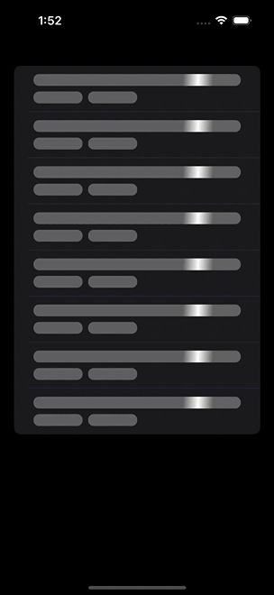

<h1 align="center" style="margin-top: 0px;">skeleton-ui</h1>

<p align="center">
<a href="https://github.com/space-code/skeleton-ui/blob/main/LICENSE"></a>
<a href="https://swiftpackageindex.com/space-code/skeleton-ui"></a> 
<a href="https://swiftpackageindex.com/space-code/skeleton-ui"></a> 
<a href="https://github.com/space-code/skeleton-ui"></a>
<a href="https://codecov.io/gh/space-code/skeleton-ui"></a>
<a href="https://github.com/apple/swift-package-manager" alt="SkeletonUI on Swift Package Manager" title="SkeletonUI on Swift Package Manager"></a>
</p>

## Description
`skeleton-ui` provides an easy way to make your views skeletonable.

- [Visual Example](#visual-example)
- [Usage](#usage)
- [Requirements](#requirements)
- [Installation](#installation)
- [Communication](#communication)
- [Contributing](#contributing)
- [Author](#author)
- [License](#license)

## Visual Example

The visual example of the `SkeletonUI`:



## Usage

To display a skeleton placeholder on your view, you can use `SkeletonView`. `SkeletonView` can be presented as either a list view or a plain view. You can configure it by simply passing a `viewType` parameter to the initializer.

```swift
import SkeletonUI

struct ContentView: View {
    struct Item: Identifiable {
        let id = UUID()
        let text: String
    }

    let data: [Item] = [
        Item(text: "Item")
    ]

    var body: some View {
        SkeletonView(
            viewType: .list,
            behavior: .manually(isEnabled: true),
            data: data,
            quantity: 1,
            configuration: SkeletonConfiguration(
                numberOfLines: 2,
                scales: [1.0, 0.5],
                spacing: 8.0,
                insets: EdgeInsets(top: 8.0, leading: 8.0, bottom: 8.0, trailing: 8.0)
            ),
            builder: { text in text.map { Text($0.text) } }
        )
    }
}
```

If you need to display a custom skeleton view, you can leverage the ``skeletonBuilder(:_)`` function provided by SkeletonUI. This function is designed to customize the appearance of individual skeleton elements within your view.

```swift
import SkeletonUI

struct ContentView: View {
    struct Item: Identifiable {
        let id = UUID()
        let text: String
    }

    let data: [Item] = [
        Item(text: "Item")
    ]

    var body: some View {
        SkeletonView(
            viewType: .list,
            behavior: .manually(isEnabled: true),
            data: data,
            quantity: 8,
            configuration: SkeletonConfiguration(
                numberOfLines: 2,
                scales: [1.0, 0.5],
                spacing: 8.0,
                insets: EdgeInsets(top: 8.0, leading: 8.0, bottom: 8.0, trailing: 8.0)
            ),
            builder: { text in text.map { Text($0.text) } },
            skeletonBuilder: { index in 
                if index == 0 {
                    RoundedRectangle(cornerRadius: 8.0)
                } else {
                    HStack {
                        RoundedRectangle(cornerRadius: 8.0)
                        RoundedRectangle(cornerRadius: 8.0)
                    }
                }
            }
        )
    }
}
```

## Requirements
- iOS 14.0+ / macOS 11.0+ / tvOS 14.0+ / watchOS 8.0+ / visionOS 1.0+
- Xcode 14.0
- Swift 5.7

## Installation
### Swift Package Manager

The [Swift Package Manager](https://swift.org/package-manager/) is a tool for automating the distribution of Swift code and is integrated into the `swift` compiler. It is in early development, but `skeleton-ui` does support its use on supported platforms.

Once you have your Swift package set up, adding `skeleton-ui` as a dependency is as easy as adding it to the `dependencies` value of your `Package.swift`.

```swift
dependencies: [
    .package(url: "https://github.com/space-code/skeleton-ui.git", .upToNextMajor(from: "1.0.0"))
]
```

## Communication
- If you **found a bug**, open an issue.
- If you **have a feature request**, open an issue.
- If you **want to contribute**, submit a pull request.

## Contributing
Bootstrapping development environment

```
make bootstrap
```

Please feel free to help out with this project! If you see something that could be made better or want a new feature, open up an issue or send a Pull Request!

## Author
Nikita Vasilev, nv3212@gmail.com

## License
skeleton-ui is available under the MIT license. See the LICENSE file for more info.